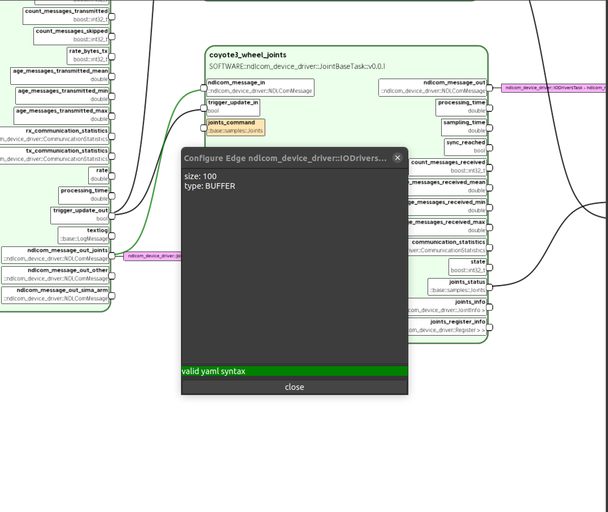

XRock GUI Model - Graphical user interface implementation for XRock models
--------------------------------------------------------------------------
X-Rock-GUI `(xrock_gui)` displays components as nodes and allows to establish connections between
nodes by drawing edges in a graph view.
Users can manage components from different database types for both hardware and software and also export the final cnd file.

X-Rock-GUI is an open source software which can be found in the xrock gui `repository <https://github.com/dfki-ric/xrock_gui_model.git>`_.

Features
--------
- **CRUD Operations:** Manage your xtypes components databases with full Create, Read, Update, and Delete functionality.
- **Visual Reconfiguration:** Reconfigure your system visually using an intuitive node and graph-based interface that allows you to seamlessly connect interfaces and components.
- **Import/Export Capability:** Import or export your final configuration as a .cnd file for deployment or further integration.
- **Multiple Database Support:** Integrate with various database types, including:

  - **Client:** For example, using a `jsondb server <https://github.com/dfki-ric/xdbi/blob/master/bin/jsondb.cpp>`
  - **Serverless:** Direct filesystem access.
  - **MultiDbClient:** Manage multiple databases concurrently by combining the capabilities of both Client and Serverless, allowing you to work with several database instances in a single interface.
- **Module Builder:** Build new xtype modules directly from the xrock gui.
- **Modular & Extensible:** Designed for flexible integration and easy extension to meet diverse project requirements.

Dependencies
------------
xrock_gui_model requires the following dependencies, which are resolved via pkg-config:

- **lib_manager:** Provides essential library management support.
- **bagel_gui:** The core GUI framework underpinning the interface.
- **osg_graph_viz:** A toolkit for graph visualization, used to display graph nodes.
- **configmaps:** Offers structured configuration management utilities.
- **mars_utils:** A collection of utility functions tailored for Mars-related applications.
- **main_gui:** Core components for the graphical user interface.
- **config_map_gui:** Provides a GUI for interacting with configuration maps.
- **cfg_manager:** A suite of tools for configuration management.
- **smurf_parser:** Parses SMURF (Standardized Model for Unified Robot Format) files.
- **xrock_io_library:** A plugin for the xrock_gui that facilitates the usage of Xtypes in the xrock_gui and the database access via xdbi.

Additionally, the module depends on Qt libraries for its graphical components:

- **Qt5Widgets** (if using Qt5)
- **QtCore** and **QtGui** (if using Qt4)

Installation
============
xrock_gui_model is built using CMake. It can be used within an autoproj workspace and is managed 
with amake. Follow these steps to configure, build, and install the tool.

Build & install into autoproj workspace
---------------------------------------
1. Open a terminal and navigate to your autoproj workspace directory
2. Source your workspace:

   .. code-block:: bash

    . env.sh

3. Build & install xrock_gui
   
   .. code-block:: bash

    amake xrock_gui_model/

2. Verify Installation

   .. code-block:: bash

    which xrock_gui

Toolbar Actions
===============

.. image:: graphics/xrockGui/toolbar.png
   :alt: ToolbarActions
   :align: center
   
When you run xrock gui, you will notice a toolbar at the top of the window. This toolbar displays several icons that let you perform various actions quickly. Below is a brief description of each icon and its functionality:

.. node_data_widget_figure::

.. image::graphics/xrockGui/DataView.png
   :alt: DataView Icon
   :align: center
   :width: 64px
   :height: 64px
- **DataView Icon:** Clicking this icon toggles the **NodeData Widget**, which displays detailed data for the selected node.

- **NodeTypes Icon:** Clicking this icon toggles the **NodeTypes Widget**, which displays and refreshes the available node types for components.

- **History Icon:** Clicking this icon toggles the **History Widget**, which records and displays the state changes and actions performed within the GUI.
  
   .. tip:: 

   You can also Undo/Redo your changes with keyboard CTRL+C (undo) & CTRL+A (redo)

.. new_model_figure::

- **NewModel Icon:** Clicking this icon creates a new graph view, allowing you to start a new model from scratch.

.. load_model_figure::

- **Load Icon:** Clicking this icon loads a component model from the configured database.

- **Add Icon:** Clicking this icon adds new components to the current model.

- **Save Icon:** Clicking this icon saves your current component model to the database.

.. image:: graphics/xrockGui/reload.png
   :alt: Reload Icon
   :align: center
   :width: 64px
   :height: 64px
- **Reload Icon:** Clicking this icon reloads the current component model from database to reflect any recent changes.

- **Remove Icon:** Clicking this icon deletes the current component model from database.
   
   .. caution::

   This operation could cause data loss!

- **Config Icon:** Clicking this icon opens the configuration dialog for advanced settings and options.

- **Abstract Icon:** Clicking this icon opens an abstract gui interface that will help you derive from abstract (atomic) component models in the database.

Database Configuration
----------------------

In xrock gui, you can configure your database connection through a dedicated configuration panel. Depending on the selected mode **Serverless**, **Client**, or **MultiDbClient** — you may need to provide additional settings.

- **Serverless:**  
  - **DB Path:** Enter the full path to your local database.
  - **Graph:** Specify the graph name associated with this database e.g, 'master'.
   
   .. image:: graphics/xrockGui/serverless.png
      :alt: Serverless
      :align: center

- **Client:**  
  - **URL:** Enter the server's URL e.g, 'http://localhost' for localhost.
  - **Port:** Specify the port on which the server is running.
  - **Graph:** Enter the graph name.  

   .. image:: graphics/xrockGui/client.png
      :alt: Client
      :align: center

  .. warning::

   You will need to run the  `jsondb` server before using Client backend type in `xrock_gui`

   .. image:: graphics/xrockGui/jsondb.png
      :alt: jsondb
      :align: center

- **MultiDbClient:**  
  This mode allows you to manage multiple databases concurrently. When selected, a pop-up window appears for configuring both the main server and additional import servers.

MultiDbClient Configuration Dialog
===================================
Within the MultiDbClient configuration dialog, you'll find a button labeled **reset to default** on the left side. Clicking this button resets your configuration based on the current bundle selection.

   

Bundle Selection and Loading
----------------------------
If your bundle is already selected in your Autoproj workspace, you can click "Reset to Default". This action will load the XDBI configuration from your selected bundle.
If the bundle is not selected, a dialog will pop up allowing you to select the bundle. Please note, this will be a one-time operation, and you can only select your bundle at the first time. 

1. **Prepare xdbi Configuration Files for the Bundle :**  

   In the configuration directory of your rock bundle, create a subdirectory named **xdbi**. Inside this directory, create a file called **db_config.json** with a template similar to the one below. Adjust the values to suit your environment:

   .. code-block:: json

      {
        "MultiDbClient": {
          "main_server": {
            "name": "main_server (write)",
            "type": "Serverless",
            "path": "database/backboneref", 
            "graph": "graph_test"
          },
          "import_servers": [
            {
              "name": "myimportserver_1 (read)",
              "type": "Serverless",
              "path": "database/atomic_component_db",
              "graph": "main"
            },
            {
              "name": "myimportserver_2 (read)",
              "type": "Client",
              "url": "http://localhost:8183/",
              "graph": "master"
            }
          ]
        }
      }

   .. tip::

   Checking `Also lookup in main_server` will allow you look into the `main_server` alongside `import_servers`.

   .. tip::
      
   You can change the `main_server` from the Main Server selection box.

   .. important:: 

      `import_servers` are read-only databases, all updates will be written to the `main_server`.

2. **Finalize Configuration:**  
   After adjusting your MultiDbClient settings in the pop-up dialog, click the **Save and Close** button to apply and save the configuration.

Creating a New ComponentModel
=============================
To start building a new ComponentModel from scratch, click the **New Model** :ref:`new_model_figure` icon on the toolbar or choose the **New Model** action from the **Database** menu. This action opens a new tab view where you can begin adding components.

Once nodes are added to your view, you can create edge connections between their interfaces. The GUI automatically verifies whether the source node's interfaces and the destination node's interfaces are compatible for a connection. As you drag an edge, the node interface's rectangle is highlighted if the connection is feasible.

After completing your model, ensure that you edit the default properties in the **ComponentModelEditorWidget** to customize your model according to your requirements.

Configure a ComponentModel
--------------------------
This section describes how to load and modify an existing ComponentModel from the database.

Load Model
==========

To load a ComponentModel from the database, follow these steps:

- Click the **Load Model** :ref:`load_model_figure` icon action.
- Once loaded, the **ComponentModelWidget** will be populated with the model's properties.

Configure Node
==============

To configure a node, first select the node you want to configure, 
then right click on it and click the **"configure node"** option. 
A dialog will appear where you can write your YAML
configuration. Once you close the dialog, 
you need to save the component model to the
database to apply the changes.

Configure Edge
==============

To configure an edge (connection), first select the edge connection between two nodes you want to configure, 
then right click on it and click the **"configure edge"** option. 
A dialog will appear where you can write your YAML
configuration. Once you close the dialog, 
you need to save the component model to the
database to apply the changes.

Decoupling
==========

If you need to decouple edges, you have two options:

- **Decouple Selected:**  
  For single edge decoupling, go to the menu action **Edit → Decouple Selected**.

- **Decouple Long Edges:**  
  To decouple multiple long edges at once, select **Edit → Decouple Long Edges**. The system will automatically decouple long edges.

Toggling
========

Each node in the graph editor has multiple interfaces (input/output connections).  You can toggle these interfaces on or off to control which connections appear in the top-level component model.

Select a node in the graph editor, then
right click on the interface and select `toggle interface` to enable or disable specific interfaces.
The node will update immediately to reflect your changes.
When you add a node to a model, only the enabled interfaces will be visible and available for connections.

Renaming Nodes
==============

While the original name of a model is immutable, you can create an alias:

- Edit the node's name via the **NodeData Widget** :ref:`node_data_widget_figure`.
- The header of the node will then display the new alias.

Open Model
==========

To open a specific model from the nodes view:

- Click the load model tool bar action :ref:`load_model_figure` 
- Right-click on the node you want to open and select **Open Model** from the context menu.
- This action opens the model in a new tab.
- You can also toggle the visibility of specific interfaces within the model by right-clicking on an interface and selecting **Toggle Interface**.
- After making the necessary changes, modify your model's properties in the **ComponentModelEditorWidget** and save back to the database by clicking the save icon.
- Optionally, you can save the model under a different version if you need to maintain multiple versions in the database.

Hardware - Software Link
========================

You can manage hardware links of a component model 
by clicking the *Manage Hadrware Links* button 
in the bottom right corner (see image below). 

Then a dialog will pop-up where you can import hardware components (ASSEMBLY domain)
from the database to configure for.

Exporting a Model to CND File
=============================

To export your current model to a CND file, follow these steps:

- Open the **File** menu in the main toolbar.
- Select the **Export** option, then **CNDModel**. If you want to export with tf_enhance then select **CNDModel with tf_enhance**.
- A dialog box will appear where you can choose the destination path and specify a file name.
- Confirm your selection to generate and save the model as a **.cnd** file.

.. image:: graphics/xrockGui/export_cnd.png
   :alt: ExportCND
   :align: center

Import CND to a Model
======================

To import a CND file, follow these steps:

- Open the **File** menu in the main toolbar.
- Select the **Import** option, then **CNDModel**. 
- A dialog box will appear where you can choose the source path of the CND file. 

